---
name: sprint-handoff
description: Sprint 开发完成交接 — Issue 驱动 → commit → 频道通知 → 评审 → 测试 → done
---

# 技能: Sprint 开发完成交接

> 代码写完不是终点。Issue 驱动，状态流转，频道通知，四步缺一不可。
> 具体 ID 值从 memory `[[project-team-channels]]` 读取。

## 统一流程

> 基于 [REPORT-v3-2026-06-16-executive.md §10.2](../../../docs/reports/REPORT-v3-2026-06-16-executive.md) 流程图。

```mermaid
flowchart LR
    classDef actor     fill:#e3f2fd,stroke:#1565c0,stroke-width:2px,color:#0d47a1
    classDef system    fill:#fff3e0,stroke:#e65100,stroke-width:2px,color:#bf360c
    classDef database  fill:#f3e5f5,stroke:#7b1fa2,stroke-width:2px,color:#4a148c
    classDef decision  fill:#fffde7,stroke:#f9a825,stroke-width:2px,color:#e65100
    classDef process   fill:#ffffff,stroke:#424242,stroke-width:1px,color:#212121
    classDef async     fill:#e0f7fa,stroke:#00838f,stroke-width:2px,color:#006064,stroke-dasharray:5 5

    style 设计规划环 fill:#e3f2fd,stroke:#1565c0,stroke-width:2px
    style 开发环 fill:#fff3e0,stroke:#e65100,stroke-width:2px
    style 测试验证环 fill:#fffde7,stroke:#f9a825,stroke-width:2px
    style 集成发布环 fill:#e8f5e9,stroke:#2e7d32,stroke-width:2px

    Z(["🛡️ Z / delez / Zederer<br>目标下发 & 设计验收 & 最终验收"]):::actor
    K("🤖 K / 小克 / Claude Code<br>开发"):::system
    M("🤖 M / 小马 / Hermes<br>测试"):::system
    C("🤖 C / 小查 / 小扣 / Codex<br>管理整合"):::system
    S[("📢 Slack 迭代协作频道")]:::database
    DM[("💬 Slack DM<br>Z → K")]:::database
    Git[("🗄️ GitHub Repo")]:::database

    Z -->|下发任务 goal| DM
    DM --> K

    subgraph 设计规划环
        direction TB
        D1["➡️ 调研需求、分析产品方案"]:::process --> D2["➡️ 输出产品方案"]:::process
        D2 --> D3["➡️ M 评审产品方案"]:::process
        D3 --> D4["➡️ C 拆分 GitHub issues<br>feature / epic"]:::process
        D4 --> D5{"❓ Z 设计验收通过?"}:::decision
        D5 -->|驳回修改| D1
    end

    K --> D1
    D5 -->|通过| N1[/📣 Slack 通知消息<br>进入开发环/]:::async
    N1 -.-> S

    subgraph 开发环
        direction TB
        P1["➡️ 认领 issue / 编写 spec"]:::process --> P2["➡️ 代码实现 + 单元测试"]:::process
        P2 --> P3["➡️ 推送功能分支 + PR 草稿"]:::process
    end

    N1 --> P1
    P3 --> P4

    subgraph 测试验证环
        direction TB
        P4["➡️ M 代码评审 + 系统测试"]:::process --> P5{"❓ 需求测试通过?"}:::decision
        P5 -->|不通过| P6["➡️ 提 bug / K 修复"]:::process
        P6 --> P4
        P5 -->|通过| P7["➡️ 创建合并 PR"]:::process
    end

    P7 --> P8

    subgraph 集成发布环
        direction TB
        P8{"❓ 发布评审通过?"}:::decision -->|驳回修改| P1
        P8 -->|验收通过| N2[/📣 Slack 通知消息<br>开发完成待发布/]:::async
        N2 --> R1["➡️ 合并发布 + 回顾总结"]:::process
        R1 --> R2["➡️ 文档整理归档"]:::process
        R2 --> R3["➡️ PR 合入 main 分支发布"]:::process
    end

    N2 -.-> S
    D4 -.->|创建 issues| Git
    P1 -.->|拉取 issue| Git
    P7 -.->|提交 PR| Git
    R3 -.->|合并 PR| Git
```



### 设计规划环

1. **Z 下发目标**：通过 Slack DM 向 K 下发本次迭代 `goal`。
2. **K 调研设计**：调研需求、分析产品方案并输出。
3. **M 评审**：K 完成后在 Slack 频道 `@M` 提请评审。
   评审必须抓第一性原因, 通过公开资源体现/佐证需求合理性与方案可行性,
   并判断与产品定位、目标用户、现有技术框架的适配度。
4. **C 规划落地**：M 通过后 `@C` 将目标拆分为可落地的 GitHub issues（feature / epic）。
5. **Z 验收**：C 汇总 issue 规划并 `@Z` 验收。
6. **判断结束节点**：若 Z 驳回，回到第 2 步继续循环；若验收通过，由独立 Slack 通知节点宣布进入开发环。

### 开发环

1. **K 认领需求**：从 GitHub issues 认领需求，编写 spec 技术方案与开发计划。
2. **开发与自测**：完成代码实现、单元测试与自测。
3. **提交 PR 草稿**：推送功能分支并创建 PR 草稿。
4. 完成后由 Slack 通知节点驱动进入测试验证环。

### 测试验证环

1. **M 代码评审**：对 PR 草稿进行代码评审，确保需求 / 方案 / 代码三者对齐。
2. **系统测试**：制定并执行集成/系统测试方案、用例与脚本，持续提 bug 并驱动 K 修复。
3. **判断结束节点**：若测试不通过，回到代码评审/修复；若通过，创建并提交合并 PR。
4. **发布评审**：C / M 评审发布特性 PR。若驳回，回到开发环重新开发；若验收通过，由 Slack 通知节点宣布进入集成发布环。

### 集成发布环

1. **用户验收与回顾**：全部需求开发测试完成后，Z 在频道发起用户验收与迭代回顾。
2. **整理报告**：各方在频道补充回顾内容；C 整理并输出产品迭代报告。
3. **合入 main**：C 将迭代报告与最终代码通过 PR 合并到 `main` 分支，并在频道通知完成发布。

### 版本优化（v4 目标）

1. **需求管理跟踪移至 Trello**：迭代目标与需求看板统一迁移到 Trello 管理；GitHub issues 继续承担 bug 跟踪。升级技能让 bot 在 Trello 卡片与 GitHub issue 之间同步状态。
2. **多需求 / BUG 并行**：依托 git tree，设计环与开发环的子环可多环并行。不同 feature / epic 在独立分支上同时推进，频道消息按需求上下文区分，避免串线。
3. **Slack stream 输出 + approve / reject**：补齐 agent 流式输出到 Slack 频道的实时渲染；在关键节点（设计验收、测试通过、发布评审）支持 approve / reject 按钮，点击后自动驱动流程进入下一节点或打回重做。


## 测试员 (M / 小马) 视角流程

**所有测试工作必须走 sprint-handoff** —— 测试不是终点, 是流程节点.

### 0. 开发转单验收清单 (SIT 交付件)

**开发说"完成"时，小马作为 tester 验收的不是零散测试，而是整套 SIT 交付件。缺少任一项就打回。**

| # | 交付件 | 检查点 | 缺项处置 |
|---|--------|--------|---------|
| 1 | **方案策略** | 测试策略文档存在（范围/方法/环境/准入标准） | 打回 |
| 2 | **用例脚本** | 测试用例列表 + 可执行脚本（`npm test`/自定义 `.test.ts` / `scripts/*.mjs`） | 打回 |
| 3 | **执行记录** | 实际运行的命令 + 完整 stdout/stderr 日志（截图/文本均可） | 打回 |
| 4 | **测试报告** | 结果汇总：通过/失败计数、关键日志、判定结论 | 打回 |
| 5 | **交付存档** | 报告文件已在 `docs/tests/cases/` 存档，含日期和 slug | 可补，勿跳过 |

> **注意**：代码写完 ≠ 功能交付完整。K 必须同时提交上述 5 项，小马才进入测试验证环。

### 1. 测试发现 (新测试)
- 跑 `npm test` / `npm run test:fast` / `npm run test:integration`
- 全过 → §4 收尾; 有失败 → §2

### 2. 失败 → 提单给 K
每个失败用例:
1. `gh issue create` (REST: `POST /repos/AINIZE-SPACE/ChorusGate/issues`) — 现象/复现命令/推测根因
2. 通知小克 `<@U0B8VHLHJAX>` 到 `<#C0BB035G3DK>` (chorusgate_v4), mention 置首行
3. **期间 issue 保持 OPEN** (不能关 —— §1 关键纪律)

### 3. 测试回归 (K 修完触发)
K push 修复后:
- `git pull` 拉最新 dev 或 feature 分支
- 重跑相关测试套件 + 全套
- 全过 → §4 收尾; 仍失败 → §5 黑事件

### 4. 回归通过 → 4 步收尾
1. **关单** `gh issue close {N} --reason completed` + comment 附 commit SHA
2. **出报告** `docs/tests/cases/{YYYY-MM-DD}-{slug}-xiaoma.md` (含: 命令/结果/边界)
3. **提交** 任何代码改动 `git add` + `commit` + `push`
4. **通知小扣** `<@U0BAGFVD8VB>` 到 `<#C0BB035G3DK>`

### 5. 回归不通过 → 黑事件
- **打回** @小克 重修 + @小扣 同步状态
- **记录** `docs/black-incidents/{YYYY-MM-DD}-{slug}.md` (失败 SHA/现象/根因/方向)
- **issue 重开** `gh issue reopen {N}` (不能关!)
- **入回顾** 列入 `docs/reports/v{N}-retro.md` 的 `## 黑事件` 段

### 6. 通知模板

测试发现 (M → K):
```
<@{K}> 测试发现 #{N}, 请修复.
*失败*: {用例名}: {现象}
*复现*: `npm test -- --test-name-pattern='...'`
*日志*: {关键 stack/console}
Refs: #{N}
```

回归通过 (M → C):
```
<@{C}> #{N} 回归通过, 已关单.
*套件*: {test/test:fast/test:integration}
*结果*: pass/fail = {N}/{N}
*报告*: docs/tests/cases/{slug}.md
*commit*: {SHORT_SHA} ({branch})
```

黑事件 (M → C, 同步):
```
<@{C}> #{N} 回归失败, 已打回 @{K} 重修 (黑事件).
*失败 SHA*: {SHORT_SHA}
*现象*: {一句话}
*入档*: docs/black-incidents/{slug}.md
*回顾*: docs/reports/v{N}-retro.md#黑事件
```

### 7. 黑事件 (Black Incident) 定义

任何 **回归失败** 或 **未走完整 sprint-handoff 流程** 导致的返工/事故, 都算黑事件.
- 写 `docs/black-incidents/{YYYY-MM-DD}-{slug}.md`
- 入 `docs/reports/v{N}-retro.md` 的 `## 黑事件` 段
- 跨迭代累计, 作下一轮流程改进的输入
- **黑事件不消音** —— 入档 + 公开, 不掩盖

## Issue 类型与状态流转

| 类型 | 粒度 | 生命周期 |
|------|------|---------|
| epic | 大（多 sprint） | backlog → in_progress → done |
| feature | 中（系统级） | proposed → approved → in_progress → in_review → done |
| story | 中（≤ 3 天） | backlog → in_progress → in_review → done |
| task | 小（≤ 1 天） | todo → in_progress → done |
| bug | 不定 | open → in_progress → fixed → verified → closed |

## 通知模板

```
<@{TESTER}> <@{REVIEWER}> {PROJECT} — {TYPE} #{N}: {标题} 开发完成，请验收。

*变更*
• {要点1}
• {要点2}

*测试*
• {N}/{N} 测试通过 | typecheck 零错误
*分支*: {branch} (已 push)

Refs: #{N}
```

## 变量参考

所有变量值从 memory `[[project-team-channels]]` 读取：

| 变量 | 说明 |
|------|------|
| `{CHANNEL_NAME}` | 开发频道名 |
| `{CHANNEL_ID}` | 开发频道 ID |
| `{TESTER}` | 测试负责人 Slack ID |
| `{REVIEWER}` | 评审负责人 Slack ID |

## Slack 通知规范

- `<@USER_ID>` 格式，放消息首行
- `chat.postMessage`: `link_names: true`
- mention 在顶层 `text`，不在 blocks

## Quality Bar

- [ ] Issue 存在且状态正确
- [ ] `git push` 到远程
- [ ] Slack 频道通知（非 DM），mention 置首行
- [ ] GitHub Issue comment 更新状态
- [ ] 关键决策记录到 project memory


