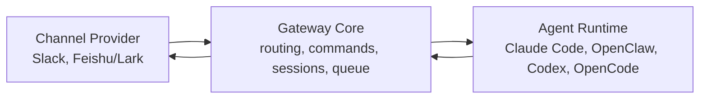

# Channel, Gateway, and Runtime Boundaries

Status: planning

## Boundary Rule

The gateway owns orchestration. Channels own platform I/O. Runtimes own agent
execution.

No channel adapter should know how a Claude Code session is resumed. No runtime
adapter should know how Slack slash commands are acknowledged. The gateway is the
only layer that binds channel events to runtime work.

## High-Level Flow



## Channel Layer

Channels normalize platform-specific I/O into gateway events.

Responsibilities:

- Connect and disconnect from the platform event source.
- Verify credentials and platform capabilities.
- Normalize messages, commands, reactions, files, threads, users, and targets.
- Send, update, reply, react, and upload through platform APIs.
- Provide platform-native command response behavior where available.
- Hide Slack `channel`/`thread_ts` and Feishu `chat_id`/`root_id` details behind
  stable gateway target IDs.

Non-responsibilities:

- Choosing an agent runtime.
- Spawning or resuming agent sessions.
- Persisting cross-channel session state.
- Implementing business logic for `/approve`, `/cancel`, or `/handoff`.

Core interfaces:

```ts
interface ChannelProvider {
  readonly id: ChannelId;
  readonly capabilities: ChannelCapabilities;
  start(args: ChannelStartArgs): Promise<void>;
  stop(): Promise<void>;
  probe(): Promise<ChannelHealth>;
  send(message: OutboundMessage): Promise<SentMessage>;
  update(message: MessageUpdate): Promise<void>;
  react(reaction: ReactionRequest): Promise<void>;
}
```

## Gateway Core

The gateway is the coordination layer.

Responsibilities:

- Route inbound events to command handling or agent execution.
- Maintain channel/thread/user to session mappings.
- Enforce per-scope serialization and global concurrency limits.
- Manage event durability, retry, replay, deduplication, and trace records.
- Track in-flight work and expose cancellation/status.
- Render runtime progress into channel-appropriate updates.
- Load config profiles and decide enabled channels and runtimes.
- Broker runtime control requests such as approval, denial, cancellation, and
  user answers through channel-native interactions.
- Allocate isolated work areas when a runtime/session needs a separate git
  worktree.

Non-responsibilities:

- Speaking Slack Web API or Feishu Open API directly.
- Knowing runtime-private session storage formats.
- Storing full conversation history.
- Installing external agent CLIs without lifecycle command consent.

Core interfaces:

```ts
interface GatewayEvent {
  id: string;
  channelId: ChannelId;
  kind: "message" | "command" | "reaction" | "file" | "lifecycle";
  target: ChannelTarget;
  actor: ChannelActor;
  text?: string;
  raw?: unknown;
}

interface SessionRouter {
  resolve(event: GatewayEvent): Promise<SessionBinding>;
  bind(binding: SessionBinding): Promise<void>;
  reset(scope: SessionScope): Promise<void>;
}
```

## Runtime Layer

Runtimes execute agent work and report progress.

Responsibilities:

- Start or resume a session.
- Stream progress, tool-use, partial output, and final output.
- Cancel in-flight work when supported.
- Inject runtime commands such as approve, deny, compress, or branch when
  supported.
- Report health and capability flags.

Non-responsibilities:

- Reading Slack or Feishu directly.
- Formatting platform-native cards or ephemeral messages.
- Owning channel permissions or command registration.

Core interfaces:

```ts
interface AgentRuntime {
  readonly id: RuntimeId;
  readonly capabilities: RuntimeCapabilities;
  probe(): Promise<RuntimeHealth>;
  startTurn(input: RuntimeTurnInput): AsyncIterable<RuntimeEvent>;
  cancel(turnId: string): Promise<void>;
  sendControl?(command: RuntimeControlCommand): Promise<void>;
}
```

## Control Plane Pattern From CC Pocket

CC Pocket's Bridge Server is a useful reference model for this boundary:

- UI/control plane is outside the coding runtime.
- The bridge/gateway runs on the machine that owns the repo and agent CLIs.
- Runtime progress, questions, approvals, and final output are streamed back to
  the UI instead of being reduced to one final text blob.
- Long-running or parallel sessions can be isolated with git worktrees.

For slack4ccmcp, Slack replaces CC Pocket's custom app and WebSocket transport.
That means we should not add a separate bridge protocol for v3, but we should
borrow the control-plane responsibilities: approval actions, offline recovery,
session isolation, and service lifecycle.

## Shared Domain Vocabulary

- Channel: a work platform such as Slack or Feishu/Lark.
- Target: a place to deliver messages, such as channel, DM, chat, or thread.
- Scope: the gateway's stable unit for serialization and session binding.
- Runtime: an executable agent backend.
- Turn: one user-triggered unit of agent work.
- Trace: a gateway-owned record of event routing, runtime events, and delivery.
- Control action: a user decision sent back into a runtime, such as approve,
  deny, cancel, answer, or continue.
- Work area: the filesystem location used by one runtime session; it may be a
  project directory or an isolated git worktree.

## Implementation Order

1. Define shared types without changing behavior.
2. Wrap current Slack behavior behind `ChannelProvider`.
3. Wrap current `claude -p` behavior behind `AgentRuntime`.
4. Move command routing and session routing into gateway-owned modules.
5. Add Feishu/Lark as a second channel provider.
6. Add OpenClaw/Codex/OpenCode/custom runtimes behind the runtime boundary.
7. Add runtime control actions and worktree allocation for sessions that need
   approvals or file isolation.

## Tracking

- Channel abstraction: #5
- Slack commands: #6
- Feishu/Lark channel: #7
- Runtime adapters: #8
- Durable events and retry: #1
- Session host / control actions: #2
- Slack approval/control loop: #32
- Session worktree isolation: #33
