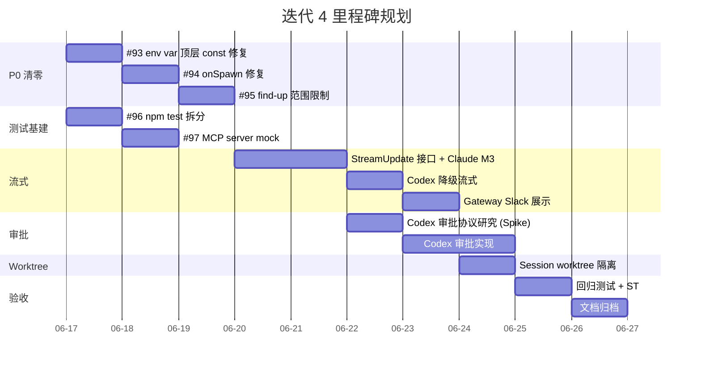

# 迭代 4 需求范围

> 状态：范围整理 | 日期：2026-06-17 | 基线：v3 执行报告 + GitHub issues + v4 规划文档
> 相关文档：[version-planning-2026-06.md](./version-planning-2026-06.md) | [v3 执行报告](../reports/REPORT-v3-2026-06-16-executive.md)

## 一、迭代 4 定位

迭代 4 的核心目标：**技术债务清零 + 补齐 v3 遗留的 Story-8 M3 流式能力 + 建立 session worktree 隔离**。不盲目扩展新通道（飞书），先把现有 Slack + Claude/Codex 双 agent 做扎实。

---

## 二、需求总览

| 类别 | 数量 | 优先级 |
|------|------|--------|
| P0 技术债务 | 3 (含 1 个拆分子任务) | 第一周必须清零 |
| P1 测试基建 | 2 | 第一~二周 |
| P2 工程质量 | 2 | 中后期 |
| Feature: 统一流式 (StreamUpdate) | 1 epic (含 Claude M3 + Codex 降级) | 核心功能 |
| Feature: Codex 统一审批 | 1 (研究 → 实现) | 核心功能 |
| Feature: Session Worktree | 1 | 高 |
| 中期：Slack 命令扩展 | 1 (分批实现) | 中 |
| 中期：安装生命周期 | 1 (分批实现) | 中 |
| 远期：飞书 / 开源 / 架构抽象 | 3 | 低，延后 |

> 对应 GitHub issues: #86, #93, #94, #95, #96, #97, #98, #99, #33, #6, #9, #7, #10, #5

---

## 三、P0 技术债务（第一周清零）

### 3.1 #93 — 修复 7 处 env var 顶层 const + 删除 MCP_SENDER_ONLY

| 项 | 说明 |
|------|------|
| **问题** | `src/` 中 7 处 `const X = process.env.Y` 在 ESM import 时早于 `bootstrap()` 求值，导致 `.env` 不生效 |
| **影响** | 配置不一致、token 读不到、P0 安全风险 |
| **修复** | 改为惰性 getter 或 `bootstrap()` 后读取；逐处替换 + 回归测试 |
| **设计文档** | `chorusgate-env-vars` 技能已沉淀规范 |
| **附加** | 删除 `.mcp.json` 中残留的 `MCP_SENDER_ONLY=1`，违反 #41 决议 |
| **负责** | Claude Code（小克） |
| **依赖** | 无 |

### 3.2 #94 — codexProvider.createSession 不调用 opts.onSpawn（#81）

| 项 | 说明 |
|------|------|
| **问题** | `codexProvider.createSession()` 没有调用 `opts.onSpawn`，导致 Codex 路径的中断/进程管理功能完全失效 |
| **影响** | `/stop` 无效、进程泄露、in-flight 不可追踪 |
| **修复** | 在 Codex spawn 后调用 `opts.onSpawn(childProcess)`，对齐 Claude provider 行为 |
| **负责** | Claude Code（小克） |
| **依赖** | 无 |

### 3.3 #95 — load-env find-up 防止跨项目 .env 读取

| 项 | 说明 |
|------|------|
| **问题** | `load-env` 的 find-up 逻辑可能沿目录树向上读取到相邻项目（如 `ChorusGate_dev`）的 `.env` |
| **影响** | P0：token/env 串号，安全风险 |
| **方案** | 限制 find-up 范围到项目根目录（检测 `package.json` 或 `.git` 作为边界） |
| **负责** | Claude Code（小克） |
| **依赖** | 无 |

---

## 四、P1 测试基建修复（第一~二周）

### 4.1 #96 — 拆分 npm test，定位 240s+ 超时

| 项 | 说明 |
|------|------|
| **问题** | `npm test` 整体超时 (240s+)，掩盖回归，CI 不稳定 |
| **根因** | 集成测试 hang（非功能回退），需要拆分 per-test timeout + case 级日志 |
| **方案** | ① 拆分：单元测试 vs 集成测试；② per-test timeout (10s 默认)；③ 定位 hang 根因 |
| **设计文档** | Sprint 3 retro 技能已沉淀测试规范 |
| **负责** | Hermes（小马） |
| **依赖** | 无 |

### 4.2 #97 — MCP server 启动脚本或 mock 降级

| 项 | 说明 |
|------|------|
| **问题** | MCP server 未启动导致 6 项 ST 失败，集成测试环境依赖外部进程 |
| **方案** | ① 提供 MCP server 启动脚本 (`scripts/start-mcp-server.sh`)；② 或提供 mock 降级（fake binary）|
| **负责** | Hermes（小马） |
| **依赖** | 无 |

---

## 五、P2 工程质量（中后期）

### 5.1 #98 — 跨 runtime 技能自动 mirror

| 项 | 说明 |
|------|------|
| **目标** | 将 ChorusGate 项目本地技能 (`.claude/skills/`) 同步到 Claude Code / Hermes / Codex 三个 agent 运行时 |
| **方案** | 脚本或 CI hook，skill 变更后自动 mirror |
| **负责** | Codex（小扣） |
| **依赖** | 无 |

### 5.2 #99 — 研究 Codex 双向审批协议

| 项 | 说明 |
|------|------|
| **目标** | 研究 `codex exec --ask-for-approval=on-request` 的 stdin/stdout 协议格式 |
| **产出** | M0 Spike fixture + 协议文档 → 输入到统一审批实现 |
| **设计文档** | [v4-story-8-unified-approval.md](./v4-story-8-unified-approval.md) |
| **负责** | Claude Code + Hermes |
| **依赖** | 无 |

---

## 六、Feature：统一流式抽象 StreamUpdate（核心功能）

> Epic: [#86](https://github.com/AINIZE-SPACE/chorusgate/issues/86)
> 设计文档：[v4-story-8-stream-incremental.md](./v4-story-8-stream-incremental.md) | [v4-story-8-unified-streaming.md](./v4-story-8-unified-streaming.md)

### 6.1 目标

定义一个 gateway 层统一的 `StreamUpdate` 接口，让 Claude（高保真 token 级增量）和 Codex（降级回合级事件）都能被 gateway 统一消费，用户感受到实时进展。

### 6.2 实现任务

| # | 任务 | 文件 | 依赖 |
|---|------|------|------|
| F1 | 定义 `StreamUpdate` / `StreamUpdateKind` / `onStreamUpdate` | `src/providers/types.ts` | 无 |
| F2 | Claude parser: 解析 `content_block_*`、`hook_event`、`result` metrics | `src/providers/claude-stream-parser.ts` | F1 |
| F3 | Claude provider: 追加 `--include-partial-messages` / `--include-hook-events` / `--model` 参数 | `src/providers/claude-stream.ts` | F2 |
| F4 | Codex parser: 解析 `turn.completed.usage`，`item.completed` 触发 text/tool_call update | `src/providers/codex-parser.ts` | F1 |
| F5 | Codex provider: 支持 `opts.model` / `CODEX_MODEL`，绑定 `onStreamUpdate` | `src/providers/codex.ts` | F4 |
| F6 | Gateway: 统一消费 `onStreamUpdate`，防抖刷新 Slack、thinking 展示、metrics 脚注 | `src/reply-engine.ts` / `src/gateway.ts` | F1~F5 |
| F7 | 新增 fixture: `claude-stream-partial-messages.jsonl`、`claude-stream-hook-events.jsonl`、`codex-usage.jsonl` | `tests/fixtures/` | F2, F4 |
| F8 | 测试: parser 单元测试、provider spawn 参数测试、gateway 降级处理测试 | `tests/` | F1~F7 |

### 6.3 关键设计决策

- **默认关闭新参数**：`CLAUDE_STREAM_PARTIAL`、`CLAUDE_STREAM_HOOK_EVENTS` 等环境变量默认 `false`，旧 CLI 版本不崩
- **增量不污染最终文本**：`text_delta` 只走回调，不写入 `assistantText`，最终文本仍以 `result.result` 为准
- **Codex 降级路径**：Codex 没有 `thinking` / `hook` / `tool_param` 事件，gateway 按"可选存在"消费
- **Slack 防抖**：默认 1000ms 间隔，防止 Slack API 限流

### 6.4 验收标准

- [ ] `CLAUDE_STREAM_PARTIAL=true` 时 Claude 能输出 token 级增量到 Slack
- [ ] `CLAUDE_SHOW_THINKING=true` 时 Extended Thinking 折叠展示在 thread
- [ ] `CLAUDE_SHOW_METRICS=true` 时最终消息追加 cost/token 脚注
- [ ] Codex 路径能输出回合级 text/tool_call/metrics 更新
- [ ] 不开启任何 M3 开关时 M2 行为完全不变
- [ ] `getResultText()` 在启用 partial 后不产生重复文本

---

## 七、Feature：Codex 统一审批（核心功能）

> Issue: [#84](https://github.com/AINIZE-SPACE/chorusgate/issues/84)（关联 #99 研究）
> 设计文档：[v4-story-8-unified-approval.md](./v4-story-8-unified-approval.md)

### 7.1 目标

让 Codex 的审批链路与 Claude 共享同一套 4-Button Approval UI（`permissionTracker` + `buildApprovalBlocks` + Slack Block Kit），用户无需感知底层是哪个 agent。

### 7.2 当前状态 vs 目标

| 维度 | Claude (已实现) | Codex (当前) | Codex (目标) |
|------|------|------|------|
| 协议 | stream-json `permission_request` | `--dangerously-bypass-approvals-and-sandbox` | stdin/stdout 交互协议 |
| 审批 UI | 4-button Slack Block Kit | 无（CLI 自己处理或跳过） | 同一套 4-button UI |
| 身份绑定 | `action_value` 编码 + 先校验 | 无 | 统一 `permissionTracker` |

### 7.3 实现任务（依赖 #99 研究结论）

| # | 任务 | 依赖 |
|---|------|------|
| A1 | 研究 Codex `--ask-for-approval=on-request` stdin/stdout 协议格式 | 无（= #99） |
| A2 | 写 M0 Spike fixture（Codex 审批交互 JSONL 样本） | A1 |
| A3 | 实现 Codex approve parser | A2 |
| A4 | Gateway 集成：Codex 审批 → Slack 4 buttons → stdin 回写 | A3 |
| A5 | 统一文档：CC + Codex 审批说明 | A4 |

---

## 八、Feature：Session Worktree 隔离（高）

> Issue: [#33](https://github.com/AINIZE-SPACE/chorusgate/issues/33)
> 设计文档：`docs/roadmap.md` 4.1 节；CC Pocket `worktree.ts` 参考实现

### 8.1 目标

当同一 repo 有多个并发 session 时，为每个 session 创建独立 git worktree，避免两个长任务同时修改一个工作树导致冲突。

### 8.2 实现任务

| # | 任务 | 说明 |
|---|------|------|
| W1 | SessionStore 记录 `worktreeDir` 字段 | schema 扩展 |
| W2 | `createWorktree(sessionId, repoPath)` | 创建 `chorusgate/<session-uuid>` 分支 + worktree |
| W3 | 在 session 创建时可选启用 `GATEWAY_WORKTREE_MODE=per-session` | 环境变量控制 |
| W4 | `removeWorktree(sessionId)` 清理 | session 结束或超时后清理 |
| W5 | 测试：并发 session 隔离、worktree 清理 | |

---

## 九、中期：Slack 命令扩展（中优先级，分批）

> Issue: [#6](https://github.com/AINIZE-SPACE/chorusgate/issues/6)
> 设计文档：[feature-slack-commands.md](./feature-slack-commands.md)

### 9.1 本迭代优先实现

| 命令 | 优先级 | 说明 | 前置依赖 |
|------|--------|------|----------|
| `/stop` | **最高** | 终止当前 channel 正在运行的 agent 进程 | #94 (onSpawn) 必须先修复 |
| `/retry` | 高 | 重新发送最后一条用户消息 | event 历史缓存 |
| `/model [name]` | 高 | 切换当前 session 模型 | `opts.model` 透传（StreamUpdate 后会自然支持） |

### 9.2 中期（依赖 Session Host）

`/approve`、`/deny`、`/branch`、`/compress`、`/background` — 依赖 Session Host（#2），不在本迭代范围。

---

## 十、中期：安装生命周期（中优先级，分批）

> Issue: [#9](https://github.com/AINIZE-SPACE/chorusgate/issues/9)
> 设计文档：[feature-install-lifecycle.md](./feature-install-lifecycle.md)

### 10.1 本迭代优先实现

| 功能 | 说明 |
|------|------|
| `scripts/install.mjs` | 一键安装脚本：检测 node / claude CLI / npm ci / build / .env |
| Claude CLI 自动检测与安装引导 | `claude --version` 检测 + 提示 `npm install -g @anthropic-ai/claude-code` |
| `doctor` 命令 | 验证 token、Socket Mode、agent CLI、cwd、文件权限 |

### 10.2 延后

系统服务注册（`service:install` / `service:uninstall`）、`/update` slash command — 依赖 #93 和稳定性基线。

---

## 十一、延后 / 不在本迭代范围

| 需求 | Issue | 原因 |
|------|-------|------|
| 飞书/Lark 支持 | #7 | 依赖 Platform 抽象重构（#5），先做扎实 Slack |
| Platform 抽象重构 | #5 | 需要稳定基线，v4 先完成流式+审批+worktree |
| 开源准备 | #10 | 安全审计完成后再做，token/配置清理优先 |
| 多 agent runtime (OpenClaw 等) | #8 | 飞书就绪后再做才有效益 |
| Session Host | #2 | 大工程，非本迭代目标 |
| Durable event state / retry queue | #1 | 稳定后再做 |

---

## 十二、负责角色分配

| 角色 | Slack ID | 迭代 4 职责 |
|------|----------|-------------|
| **小克 (Claude Code)** | `<@U0B8VHLHJAX>` | P0 修复（#93 #94 #95）、StreamUpdate 实现、Codex 审批协议研究+实现、Worktree 实现 |
| **小马 (Hermes)** | `<@U0B91BVKTL2>` | P1 测试基建（#96 #97）、M3 fixture 编写、StreamUpdate 测试、ST 回归 |
| **小扣 (Codex)** | `<@U0B92RM5AGH>` / `<@U0BAGFVD8VB>` | P2 技能 mirror（#98）、流程协调、文档归档 |

---

## 十三、迭代 4 里程碑建议

---

## 十四、关键风险

| 风险 | 影响 | 缓解 |
|------|------|------|
| Codex 审批 stdin/stdout 协议不可行 | 统一审批只能做 Claude 端 | #99 Spike 先行验证，不通过则 Codex 审批降级 |
| Codex JSONL schema 变化 | parser 崩溃 | 防御性解析：未知字段忽略 |
| StreamUpdate 抽象引入复杂度 | 维护成本上升 | 枚举完备、单测覆盖降级路径 |
| 时间不够（需求量大） | 中期功能来不及 | 严格执行 P0 → Feature → 中期优先级，远期延期明确 |

---

*生成日期：2026-06-17*
*整理：Claude Code（小克）*
