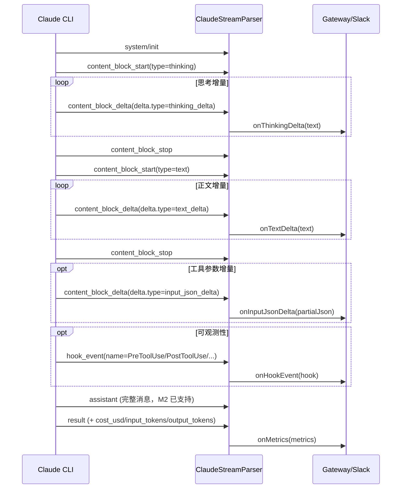

<!-- STORY-8 M3: Claude stream-json 增量内容块 / Extended Thinking / Hook 事件 设计方案 -->
# STORY-8 M3：Claude stream-json 增量内容块与可观测性增强

> 状态：🟡 设计稿 (M3) | 依赖 M2 已实现 | Epic: [v3 EPIC](./v3-epic.md) | P1
> 跟踪: [#34](https://github.com/AINIZE-SPACE/chorusgate/issues/34) | 相关: [#32](https://github.com/AINIZE-SPACE/chorusgate/issues/32)
> 文档基线: [v3-story-8-claude-stream-json.md](./v3-story-8-claude-stream-json.md)

## 1. 背景与目标

M2 已经落地 Claude 双向 `stream-json` 控制面（`system/init`、`permission_request`、`assistant`、`result`）。
M3 在保持 M2 行为稳定的前提下，开启 CLI 的增量事件能力，使 ChorusGate 能够：

1. **实时展示思考与回复**：捕获 `--include-partial-messages` 产生的 `content_block_delta`，把 Extended Thinking 和正文增量同步到 Slack。
2. **获取成本与 Token 指标**：从 `result` 事件解析 `cost_usd` / `input_tokens` / `output_tokens`。
3. **增强可观测性**：通过 `--include-hook-events` 订阅 Hook 生命周期事件，用于调试、审计和链路追踪。
4. **支持模型选择**：通过 `--model` 显式选择支持 Extended Thinking 的模型。

### 非目标

- 不替换 M2 的 `claudeStreamProvider` / `createStreamSession` 双 API。
- 不默认开启所有新功能：新参数采用显式 opt-in，避免旧 CLI 版本不兼容。
- 不要求 Slack 做到每个 token 都刷新（受限于 Slack API 速率），采用“聚合 + 防抖”更新策略。

## 2. CLI 参数变更

在现有 spawn 参数基础上，新增以下可选参数：

| 参数 | 生效条件 | 用途 |
|------|---------|------|
| `--include-partial-messages` | `-p` + `--output-format stream-json` | 输出 `content_block_delta` 增量事件 |
| `--include-hook-events` | `--output-format stream-json` | 输出 `hook_event` 生命周期事件 |
| `--model <model>` | `-p` | 指定模型，如支持 Extended Thinking 的模型 |

> 参考文档要点：`--include-partial-messages` 仅在 print 模式下生效； ChorusGate 当前已经使用 `-p`，因此天然满足。

### spawn 示例（M3 完整形态）

```typescript
spawn("claude", [
  "-p",
  "--input-format", "stream-json",
  "--output-format", "stream-json",
  "--verbose",
  "--replay-user-messages",
  "--include-partial-messages",   // opt-in
  "--include-hook-events",        // opt-in
  "--model", process.env.CLAUDE_MODEL || "claude-sonnet-4-20250514",
  "--permission-mode", process.env.CLAUDE_PERMISSION_MODE || "bypassPermissions",
  "--session-id", sessionId,
]);
```

## 3. 事件状态机

M3 在 M2 的事件流中插入三类新事件：



### 关键约定

- `assistant` 事件在 block stop 后仍会输出完整内容；**不要把增量累加到最终文本**，否则会出现重复。
- `result` 事件的 `result` 字段保持为最终字符串；新增字段 `cost_usd`、`input_tokens`、`output_tokens` 仅用于指标展示。
- `content_block_delta` 的字段名遵循 CLI 规范：
  - `thinking_delta` 的文本在 `delta.thinking`
  - `text_delta` 的文本在 `delta.text`
  - `input_json_delta` 的部分 JSON 在 `delta.partial_json`

## 4. 数据结构与回调扩展

### 4.1 新增类型（建议在 `src/providers/claude-stream-parser.ts`）

```typescript
/** 当前活跃的 content block 类型 */
export type ContentBlockType = "thinking" | "text" | "tool_use" | "image" | string;

export interface ContentBlockStart {
  type: ContentBlockType;
  // 未来可扩展：tool_use 的 name/id、image 的 mime 等
}

/** content_block_delta 的统一形状 */
export type ContentBlockDelta =
  | { type: "text_delta"; text: string }
  | { type: "thinking_delta"; thinking: string }
  | { type: "input_json_delta"; partialJson: string }
  | { type: string; [key: string]: unknown };

/** hook_event 载荷 */
export interface HookEvent {
  name: string;
  // 不同 hook 类型字段差异较大，保留宽松结构
  payload: Record<string, unknown>;
}

/** result 事件中的成本与 token 指标 */
export interface ClaudeMetrics {
  costUsd?: number;
  inputTokens?: number;
  outputTokens?: number;
  durationMs?: number;
}
```

### 4.2 ClaudeStreamParser 新增回调

```typescript
export class ClaudeStreamParser extends ClaudeEventParser {
  // M2 已有：onPermissionRequest / onInit / onApiRetry / onUserReplay

  /** 正文增量 */
  onTextDelta?: (text: string) => void;
  /** Extended Thinking 增量 */
  onThinkingDelta?: (thinking: string) => void;
  /** 工具参数 JSON 片段 */
  onInputJsonDelta?: (partialJson: string) => void;
  /** content block 开始 */
  onContentBlockStart?: (block: ContentBlockStart) => void;
  /** content block 结束 */
  onContentBlockStop?: (blockType: ContentBlockType) => void;
  /** Hook 生命周期事件 */
  onHookEvent?: (hook: HookEvent) => void;
  /** 最终指标 */
  onMetrics?: (metrics: ClaudeMetrics) => void;

  /** 解析完成后可读取的指标 */
  get metrics(): ClaudeMetrics | null;

  // 内部状态
  private currentBlockType: ContentBlockType | null = null;
  private _metrics: ClaudeMetrics | null = null;
}
```

### 4.3 Provider 接口微调（建议在 `src/providers/types.ts`）

为了一次性传递流式更新回调，建议给 `CreateSessionOptions` 增加可选字段：

```typescript
export interface StreamUpdate {
  kind: "text" | "thinking" | "hook" | "metrics" | "block_start" | "block_stop";
  payload: unknown;
}

export interface CreateSessionOptions {
  // ... 现有字段 ...

  /** 模型选择（仅 Claude stream-json 生效） */
  model?: string;

  /** 流式增量更新回调（M3） */
  onStreamUpdate?: (update: StreamUpdate) => void;
}
```

> 备注：`onStreamUpdate` 是 `onProgress` 的流式补充；两者可同时存在，`onProgress` 仍用于粗粒度工具标签。

## 5. Gateway / Slack 展示策略

M3 的展示目标是“用户能感受到实时进展”，同时避免 Slack API 被高频刷新拖垮。

### 5.1 消息模型

Gateway 在调用 provider 时传入 `onStreamUpdate`，内部维护：

- `streamMessageTs`：Slack 上用于实时更新的消息 `ts`。
- `textBuffer`：已累积的正文增量。
- `thinkingBuffer`：已累积的思考增量。
- `lastUpdateAt`：上一次调用 `chat.update` 的时间戳（防抖）。

### 5.2 更新规则

| 事件 | 默认行为 | 可配置项 |
|------|---------|---------|
| `block_start(thinking)` | 在 thread 或同一条消息中显示“🧠 思考中…”占位 | `CLAUDE_SHOW_THINKING=true/false` |
| `thinking_delta` | 追加到 thinkingBuffer，不直接刷新 Slack | `CLAUDE_SHOW_THINKING=true` 时按间隔刷新 |
| `block_start(text)` | 显示“💬 回复中…”占位 | - |
| `text_delta` | 追加到 textBuffer，按防抖间隔刷新 Slack | `CLAUDE_STREAM_UPDATE_INTERVAL_MS`（默认 1000ms） |
| `block_stop` | 立即刷新对应 block，清空 buffer | - |
| `hook_event` | 仅写入 stderr / debug 日志，不展示给用户 | `CLAUDE_LOG_HOOK_EVENTS=true` 可输出到 diagnostics thread |
| `result` + metrics | 最终消息末尾追加 `⏱️ 1234 tokens · $0.0032` | `CLAUDE_SHOW_METRICS=true/false` |

### 5.3 关于 Thinking 的展示

- 默认 **不展示** thinking 内容（避免噪声）。
- 当 `CLAUDE_SHOW_THINKING=true` 时，thinking 内容可作为 Slack message 的 `attachments` 或 thread 回复，使用 `mrkdwn` 折叠块：
  ```
  > *Extended Thinking*
  > <thinking 文本>
  ```
- 注意：思考块可能很长，建议截断到 2900 字符以内，避免 Slack block 超限。

### 5.4 关于 Hook 事件

- 不默认向业务频道发送 hook 事件，避免刷屏。
- 可用于：
  - gateway 自身日志（`console.error`）
  - 可选的 diagnostics Slack 频道
  - 未来构建“工具调用审计”功能时的数据源

## 6. 配置开关（环境变量）

新增以下环境变量，全部默认关闭/不设置，确保向后兼容：

| 变量 | 说明 | 默认值 |
|------|------|--------|
| `CLAUDE_STREAM_PARTIAL` | 是否添加 `--include-partial-messages` | `false` |
| `CLAUDE_STREAM_HOOK_EVENTS` | 是否添加 `--include-hook-events` | `false` |
| `CLAUDE_MODEL` | 指定 `--model` 的值；为空时不传该参数 | `undefined` |
| `CLAUDE_SHOW_THINKING` | 是否在 Slack 展示 thinking 块 | `false` |
| `CLAUDE_SHOW_METRICS` | 是否在最终消息展示 cost/token | `false` |
| `CLAUDE_LOG_HOOK_EVENTS` | 是否把 hook 事件输出到 stderr/diagnostics | `false` |
| `CLAUDE_STREAM_UPDATE_INTERVAL_MS` | Slack 流式消息刷新防抖间隔 | `1000` |

### 建议的 profile 配置示例

```bash
# .env 或 per-profile env
GATEWAY_CLAUDE_MODE=stream
CLAUDE_STREAM_PARTIAL=true
CLAUDE_STREAM_HOOK_EVENTS=true
CLAUDE_MODEL=claude-sonnet-4-20250514
CLAUDE_SHOW_THINKING=true
CLAUDE_SHOW_METRICS=true
```

## 7. 解析器实现要点

1. **新增事件分支**  
   在 `ClaudeStreamParser.feed()` 中，对 `type` 为 `content_block_start` / `content_block_delta` / `content_block_stop` / `hook_event` 的事件先处理；其余事件仍委托给父类或 M2 分支。

2. **result 事件增强**  
   先由 `ClaudeStreamParser` 提取 `cost_usd`、`input_tokens`、`output_tokens`，再调用 `super.feed(line)` 让父类保存 `resultText`。这样 `getResultText()` 行为不变。

3. **不重复累加最终文本**  
   `text_delta` 只用于回调和缓冲，不要写入父类的 `assistantText`。最终文本仍以 `result.result` 或 `assistant` 事件为准。

4. **状态机简单清晰**  
   维护 `currentBlockType`，遇到 `content_block_stop` 时根据类型触发对应清理逻辑；遇到未知 block 类型时降级为透传回调，不报错。

5. **Hook 事件字段兼容**  
   `hook_event` 的具体结构可能随 CLI 版本变化，解析时只取 `name`，其余字段原样放入 `payload`，避免 schema  rigid 导致升级失败。

## 8. Provider 改动清单

- `claudeStreamProvider.createSession()` / `resumeSession()`：
  - 根据环境变量决定是否追加 `--include-partial-messages`、`--include-hook-events`、`--model`。
  - 将 `opts.onStreamUpdate` 映射到 parser 的各增量回调。
  - 继续保留 M2 的一次性语义（结果返回后关闭 stdin）。

- `createStreamSession()`：
  - 同样追加新 CLI 参数。
  - 支持 `opts.onStreamUpdate` 和 `opts.model`。
  - 保持 stdin 打开，支持 permission_request 审批。

- 建议抽象公共参数构建函数，避免在 provider 和 createStreamSession 两处重复：
  ```typescript
  function buildClaudeStreamArgs(opts: { sessionId?: string; resume?: boolean }): string[]
  ```

## 9. 测试策略

### 9.1 Fixture

新增两个 fixture 文件：

- `tests/fixtures/claude-stream-partial-messages.jsonl`
  - 覆盖 `thinking` block 完整生命周期 + `text` block 完整生命周期 + `input_json_delta` + `result` 含 metrics。
- `tests/fixtures/claude-stream-hook-events.jsonl`
  - 覆盖 `PreToolUse`、`PostToolUse`、`Notification`、`Stop` 等 hook_event。

### 9.2 单元测试（parser）

- 验证各类 delta 回调触发次数与内容正确。
- 验证 `metrics` 对象在 result 后正确填充。
- 验证启用 partial 后，`getResultText()` 仍与 M2 一致（不重复）。
- 验证未知 delta 类型不会抛错。

### 9.3 集成测试（provider spawn 参数）

- 当 `CLAUDE_STREAM_PARTIAL=true` 时，spawn 参数包含 `--include-partial-messages`。
- 当 `CLAUDE_STREAM_HOOK_EVENTS=true` 时，spawn 参数包含 `--include-hook-events`。
- 当 `CLAUDE_MODEL=xxx` 时，spawn 参数包含 `--model xxx`。
- 当环境变量未设置时，不追加这些参数。

### 9.4 E2E（可选）

- 用一个模拟 CLI 脚本输出 M3 事件流，验证 gateway 的 Slack 消息更新链路至少不崩溃。

## 10. 验收标准

- [ ] 设置 `CLAUDE_STREAM_PARTIAL=true` 后，`claudeStreamProvider` 和 `createStreamSession` 都会带 `--include-partial-messages` 启动。
- [ ] Parser 能正确触发 `onContentBlockStart`、`onTextDelta`、`onThinkingDelta`、`onInputJsonDelta`、`onContentBlockStop`。
- [ ] Parser 在 `result` 事件后能通过 `metrics` / `onMetrics` 读取 `cost_usd`、`input_tokens`、`output_tokens`。
- [ ] 不启用 M3 开关时，M2 的所有测试（21/21）仍然通过，行为不变。
- [ ] `getResultText()` 在启用 partial 后不会产生重复文本。
- [ ] Hook 事件默认不向用户频道发送；开启 `CLAUDE_LOG_HOOK_EVENTS=true` 后可进入日志/诊断频道。
- [ ] Slack 实时更新有防抖，间隔可通过 `CLAUDE_STREAM_UPDATE_INTERVAL_MS` 配置。

## 11. 风险与兼容性

| 风险 | 影响 | 缓解措施 |
|------|------|----------|
| 旧版 Claude CLI 不认识新参数 | spawn 失败 | 新参数默认关闭，仅当环境变量显式开启时追加 |
| `assistant` 事件与 `text_delta` 内容重复 | 最终文本被重复累加 | 增量只用于回调/缓冲，不写入父类 `assistantText` |
| 高频 delta 导致 Slack 限流 | 消息更新失败或延迟 | 聚合缓冲 + 防抖刷新；默认 1s 间隔 |
| thinking 块过长 | Slack block 超限 | thinking 展示默认关闭；开启时截断 + 线程化 |
| Hook 事件结构变化 | parser 崩溃 | 只取 `name`，其余字段透传 `payload` |
| `--model` 与 session 续接冲突 | resume 时使用旧模型 | resume 流程同样读取 `CLAUDE_MODEL`；若 CLI 不支持 resume 换模型，则按 CLI 行为 |

## 12. 实现任务清单

- [ ] 1. `src/providers/types.ts`：新增 `model?: string`、`StreamUpdate`、`onStreamUpdate?`。
- [ ] 2. `src/providers/claude-stream-parser.ts`：
  - 新增类型与回调；
  - 实现 `content_block_*`、`hook_event`、`result` metrics 解析。
- [ ] 3. `src/providers/claude-stream.ts`：
  - 根据环境变量追加 CLI 参数；
  - 把 `onStreamUpdate` 映射到 parser 回调；
  - 提取公共 `buildClaudeStreamArgs`。
- [ ] 4. `src/reply-engine.ts` / `src/gateway.ts`：消费 `onStreamUpdate`，实现 Slack 防抖更新。
- [ ] 5. 新增 fixture：`claude-stream-partial-messages.jsonl`、`claude-stream-hook-events.jsonl`。
- [ ] 6. 新增/更新测试：parser 单元测试、provider spawn 参数测试。
- [ ] 7. 更新 `.env.example` 和本设计文档。

## 13. 与 M2 的关系

本设计稿是 [v3-story-8-claude-stream-json.md](./v3-story-8-claude-stream-json.md) 的 M3 扩展，**不覆盖 M2 内容**。实施时先确保 M2 行为稳定，再按本清单逐步开启 M3 功能。
