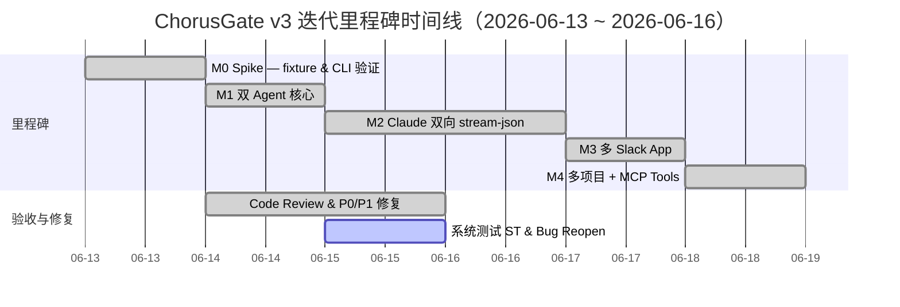
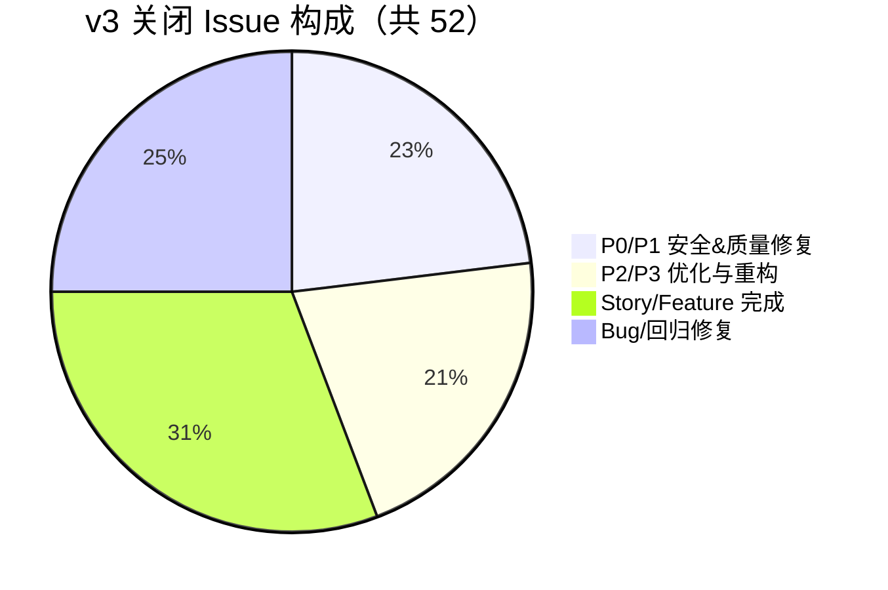
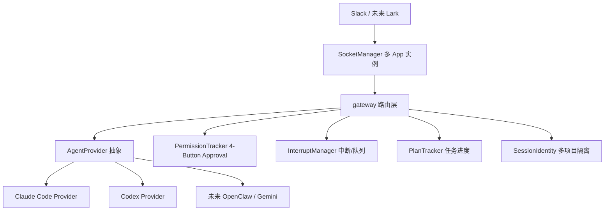

---
title: ChorusGate v3 迭代总结 —— 项目级汇报
author: Codex（管理整合）
date: 2026-06-16
audience: 管理层 / 项目老板
branch: v3/story-8-claude-stream-json
---

# ChorusGate v3 迭代总结 —— 项目级汇报

> **汇报日期**: 2026-06-16  
> **汇报人**: Codex（管理整合），结合 delez / Zederer（老乐，项目作者；GitHub 账号 delez，Slack 账号 Zederer）、小马（评审/测试）、Claude Code（开发）、Hermes（测试）四份报告  
> **目标受众**: 管理层 / 项目老板  
> **迭代分支**: `v3/story-8-claude-stream-json`

---

## 一、执行摘要（老板视角）

**迭代三（Sprint 3）已完整交付核心目标**：把 ChorusGateway 从“单 Claude Code Slack bot”扩展为“多 AI agent + 多 Slack App + 多项目”的通用协作网关。

- **全部 4 个里程碑（M0~M4）达成**，包含架构抽象、双向 stream-json、4-Button 审批、多 Slack App、多项目隔离。
- **52 个 issue 全部闭环**，其中 12 项 P0/P1 安全/质量修复（权限逃逸、命令注入、状态不一致等）全部修复。
- **TypeScript 零错误**；测试基线 100+ 用例通过，当前因集成用例 hang 导致 `npm test` 超时，需拆分定位（非功能回退）。
- **沉淀 7 个技能/规范**：4 个项目本地技能 + 3 个 summit-saw 跨项目 domain 知识。

**一句话结论**：v3 在功能、安全、可扩展性三方面都完成了从“原型”到“可 multi-tenant 运行”的关键跃迁，剩余 3 项技术债务计划在 v4 前两周内清零。

---

## 二、关键数据一览

| 指标 | 数值 | 备注 |
|------|------|------|
| 里程碑达成 | **M0~M4 全部 ✅** | 原计划 M4，M2 提前完成 |
| Issues 创建/关闭 | 60+ / **52** | 含 12 项 P0/P1 安全/质量修复 |
| Commits | **23** | `v3/story-8-claude-stream-json` |
| 新增/修改文件 | 20+ / 30+ | 含测试、provider、gateway、profile 配置 |
| 总测试用例 | **100+** | 早前基线全部通过；当前集成 runner 超时待定位 |
| TypeScript 检查 | **0 错误** | `npm run typecheck` 通过 ✅ |
| 系统测试 ST | **16/20 (80%)** | 4 项失败：分支落后 2 项、#81 onSpawn 1 项、MCP server 未启动 3 项 |
| 技能沉淀 | **7 个** | 4 个项目技能 + 3 个 summit-saw domain |

---

## 三、里程碑与进度

### 3.1 里程碑交付时间线



### 3.2 里程碑内容

| 里程碑 | 核心交付 | 业务价值 |
|--------|---------|---------|
| **M0 Spike** | codex / claude-stream JSONL fixture | 验证真实 CLI 输出，固化测试数据 |
| **M1 双 Agent 核心** | `AgentProvider` 接口、`CodexProvider`、统一 Session | 以后接入新 agent 只需实现一个接口 |
| **M2 stream-json** | 双向 JSON 管道、4-Button Approval、Interrupt、Plan Tracker | 用户可在 Slack 审批、中断、看进度 |
| **M3 多 Slack App** | `SocketManager` 多实例、`GATEWAY_PROFILES` | 一套部署服务多个 workspace/客户 |
| **M4 多项目 + MCP** | `SessionIdentity`、per-profile token、Codex TOML | 同一会话切换项目，token 不串号 |

---

## 四、Issue 与质量分布

### 4.1 Issue 关闭构成



### 4.2 P0/P1 安全修复清单

| 级别 | 问题 | 影响 | 修复方式 |
|------|------|------|---------|
| P0 | 任何人可审批他人请求 | 权限逃逸 | `action_value` 编码 requesterUserId + gateway 先校验再 resolve |
| P0 | 审批按钮 resolve 后仍可点击 | 重复审批/状态混乱 | `chat.update` 替换为确认文本 |
| P0 | 用 `--resume` 而非 `--session-id` | session 状态不一致 | `createSession` 强制 `--session-id` |
| P0 | 缺失 4 类测试覆盖 | 回归风险 | 新增 claude-stream-integration、block-actions、permission-tracker 测试 |
| P1 | auth check after resolution | 先放行后校验 | 先校验 userId 再 resolve |
| P1 | untracked SIGKILL timer | 内存泄漏 | exit 事件清理 timer |
| P1 | cmd.exe 元字符注入 | 命令注入 | `& \| > < ^ %` 转义 |

---

## 五、架构演进（前后对比）

### 5.1 迭代前

```
用户 Slack 消息
    ↓
单 Claude Code CLI
    ↓
单项目 / 单 Slack App
    ↓
无审批、无中断、无进度
```

### 5.2 迭代后



---

## 六、角色复盘

| 角色 | 主要职责 | 做得好的 | 下轮纪律 |
|------|---------|---------|---------|
| **Claude Code（开发）** | Provider 抽象、Claude 双向 stream-json、SocketManager、SessionIdentity、4-Button Approval | 拆分清晰；主动降级 Codex 能力缺口；安全修复响应快 | ① env fix 必须“改前 rg / 改后 rg / 回归测试”；② 新增入口函数必加 ST；③ spawn/flag 修改必须真实验证 |
| **Hermes（测试）** | ST 计划、Bug Reopen、技能沉淀 | 独立评估视角；工具链 resilient；把反模式抽象成技能 | ① ST 分组标注“真实 CLI / fake binary”；② per-test timeout + case-level 日志；③ MCP server 提供 mock 或启动脚本 |
| **Codex（管理/整合）** | 主持收尾、整合报告、技能分层、domain 抽取 | 复用现有技能框架；保守分层；把管理动作文档化 | ① story 启动先 load `chorusgate-env-vars` + `sprint-handoff`；② 安全/Env fix 必须 review rg 前后截图；③ 迭代中点检查入口 ST 覆盖 |

---

## 七、关键教训（Top 6）

| # | 教训 | 来源 | 已沉淀到技能 |
|---|------|------|-------------|
| 1 | **模块顶层 `const X = process.env.Y` 在 ESM import 时早于 `bootstrap()` 求值**，导致 `.env` 不生效 | #36 / #41 / P2-1 | `chorusgate-env-vars` |
| 2 | **新增入口函数必须同时加集成测试（ST）**，否则 mock 通过、真实路径漏测 | #76 / #79 | `sprint-handoff` / `problem-diagnosis` |
| 3 | **审批权限必须先校验身份再 resolve promise**，不能先放行再校验 | #36 / P0-3 | `chorusgate-approval-interrupt` |
| 4 | **不同 agent 的流式能力差异巨大**，gateway 必须按“可选存在”消费事件 | #86 | `chorusgate-stream-adapter` |
| 5 | **Slack mention 通知必须 `link_names:true` + `<@U>` 放顶层 text + 发频道非 DM** | #59 | `notification-templates` |
| 6 | **本地分支必须每日 `git fetch` 比对 GitHub HEAD**，否则 fix commit 在远端本地未合入 | #76~#79 reopen | `workflow-skills-evolution` |

---

## 八、技能沉淀与分层

按 `reflection-skill-evolution` 治理规则，知识按 **base → adapter → project-local → domain** 分层：

| 层级 | 内容 | 位置 |
|------|------|------|
| **Project-local** | ChorusGate 专用实现规范 | `ChorusGate_Test/.agents/skills/` 与 `.claude/skills/` |
| **Domain** | 跨项目多 agent 网关通用模式 | `summit-saw/domains/dev/agent-gateway-retrospective.md` |

### 8.1 项目本地技能（4 个）

| 技能 | 作用 | 触发场景 |
|------|------|---------|
| `chorusgate-env-vars` | ESM 下 env var 安全读取规范 | 任何 `process.env` 读写 |
| `chorusgate-stream-adapter` | 统一 `StreamUpdate` 接口，屏蔽 Claude/Codex 差异 | 新增 provider、parser、gateway 展示逻辑 |
| `chorusgate-approval-interrupt` | 4-Button Approval + Interrupt 安全控制 | 审批按钮、中断、kill、timer 清理 |
| `sprint-handoff` | Issue → commit → 频道通知 → 评审 → 测试 → done | 每个 story 收尾 |

### 8.2 抽到 summit-saw domain 的知识

| 通用模式 | 位置 |
|---------|------|
| 多 agent 网关 Provider 抽象 | `summit-saw/domains/dev/agent-gateway-retrospective.md` |
| 统一流式事件 `StreamUpdate` | 同上 |
| 审批身份绑定 / 防重入 / scope 缓存 | 同上 |
| ESM env 早绑通用规范 | 关联 `test-spawn-fake-binary.md` |
| spawn fake binary 测试模式 | `summit-saw/domains/dev/test-spawn-fake-binary.md` |

---

## 九、剩余风险与 v4 规划

### 9.1 当前风险（需老板关注）

| 风险 | 优先级 | 影响 | 处理状态 |
|------|--------|------|---------|
| `.mcp.json` 残留 `MCP_SENDER_ONLY=1` | P0 | 违反 #41 决议 | 已识别，待 commit |
| `src/` 仍有 7 处 env var 顶层 const | P0 | `.env` 配置不生效 | 已识别，待 Claude Code 修复 |
| `npm test` 240s+ 超时 | P1 | CI 不稳定，掩盖回归 | 最近一次 304s 超时；需拆分定位 |
| `load-env find-up` 可能读到相邻项目 `.env` | P0 | token/env 串号 | defer v4 |
| MCP server 未启动导致 6 项 ST 失败 | P1 | 集成测试环境依赖 | 需启动脚本或 mock |

> 对应 GitHub issues: #93、#95、#96、#97\n\n### 9.2 v4 关键行动

| 优先级 | 行动 | 负责角色 | 目标时间 |
|--------|------|---------|---------|
| P0 | 修复剩余 7 处 env var 顶层 const + 删 `.mcp.json` MCP_SENDER_ONLY | Claude Code | v4 第 1 周 |
| P0 | 完成 #81 `opts.onSpawn` 修复并 push | Claude Code | v4 第 1 周 |
| P0 | `load-env` 限制 find-up 范围，防止跨项目读取 | Claude Code | v4 第 1 周 |
| P1 | 拆分 `npm test`、加 per-test timeout、定位 hang 根因 | Hermes | v4 第 1~2 周 |
| P1 | 提供 MCP server 启动脚本或 mock 降级 | Hermes | v4 第 2 周 |
| P2 | 跨 runtime skill 自动 mirror（Claude Code / Hermes / Codex） | Codex | v4 中后期 |
| P2 | 研究 Codex 双向批准协议（v4 #84） | Claude Code + Hermes | v4 中后期 |

> 对应 GitHub issues: #93、#94、#95、#96、#97、#98、#99\n\n### 9.3 v4 业务方向

| Issue | 方向 | 优先级 |
|-------|------|--------|
| #33 | Session worktree 隔离 | 高 |
| #7 | 飞书/Lark 通道支持 | 中 |
| #8 | Multi-agent runtime adapters（OpenClaw） | 中 |
| #6 | Slack 命令/控制面扩展 | 中 |
| #9 | 安装/卸载/诊断生命周期 | 低 |
| #10 | 开源准备 | 低 |

---

## 十、OPC 组织管理经验：碳硅基协作新模式

> 注：delez 是同一人在 GitHub 等代码系统的账号，Zederer（老乐）是其在 Slack 的账号；以下统一以 delez / Zederer（老乐）表述。

> 本项目不仅是“做一个 Slack Gateway”，更是在**边开发边使用**的过程中，验证了一种“碳基指挥 + 硅基执行”的 OPC（Organic-Program Collaboration）组织形态。

### 10.1 组织成员与分工

ChorusGate v3 迭代由一个碳基核心 + 三个硅基数字员工组成，所有协同通过 Slack 频道 `<#C0BAB3Y7LLC>` 完成：

| 类型 | 角色 | Slack ID | 主要职责 |
|------|------|----------|---------|
| 碳基 | **delez / Zederer（老乐）** | GitHub: `delez` / Slack: `<@U0AHDRREVPD>` | 项目作者 / Master 指挥家：需求输入、关键决策、架构方向、最终验收 |
| 硅基 | **小克 / Claude Code** | `<@U0B8VHLHJAX>` | 开发 BOT：Provider 抽象、Claude stream-json、多 Slack App、多项目隔离 |
| 硅基 | **小马 / Hermes** | `<@U0B91BVKTL2>` | 测试 BOT：ST 计划、Bug Reopen、评审、技能沉淀 |
| 硅基 | **小查 / 小扣 / Codex** | `<@U0B92RM5AGH>` / `<@U0BAGFVD8VB>` | 管理整合 BOT：主持收尾、报告整合、技能分层、domain 抽取、推送通知 |

### 10.2 通过 Slack 频道跑迭代三闭环（设计环 → 开发环 → 发布回顾环）

迭代目标由 Z 通过 Slack DM 下发给 K，后续设计环、开发环、发布回顾环串行推进；各环之间通过独立的 Slack 频道通知节点衔接，GitHub Repo 仅作为 issues / PRs 的 artifact 库，不是流程节点。

```mermaid
flowchart LR
    Z["Z / delez / Zederer（老乐）<br>目标下发 & 设计验收 & 最终验收"]
    K["K / 小克 / Claude Code<br>开发"]
    M["M / 小马 / Hermes<br>测试"]
    C["C / 小查 / 小扣 / Codex<br>管理整合"]
    S["<#C0BAB3Y7LLC><br>Slack 迭代协作频道"]
    DM["Slack DM<br>Z → K"]
    Git[(GitHub Repo)]

    Z -->|下发迭代 goal| DM
    DM --> K

    subgraph 设计环
        direction TB
        D1["K 调研需求、分析产品方案"] --> D2["K @M 评审产品方案"]
        D2 --> D3["M @C 规划落地 GitHub issues<br>feature / epic"]
        D3 --> D4["C @Z 验收"]
        D4 --> D5{设计验收通过?}
        D5 -->|补充要求| D1
    end

    K --> D1
    D5 -->|通过| N1["Slack 频道通知<br>进入开发环"]
    N1 -.-> S

    subgraph 开发环
        direction TB
        P1["K 从 issues 认领需求"] --> P2["K 设计 spec、开发、单元测试"]
        P2 --> P3["K @M 评审代码与需求方案对齐"]
        P3 --> P4["M 制定集成/系统测试方案策略、用例、脚本"]
        P4 --> P5["M 运行脚本，持续提 bug 并 @K 修复"]
        P5 --> P6{需求测试通过?}
        P6 -->|未通过| P2
        P6 -->|通过| P7["M 输出需求测试报告"]
        P7 --> P8["M @C 评审发布特性 PR"]
    end

    N1 --> P1
    P8 -->|进入下一需求| P1
    P8 -->|全部需求完成| N2["Slack 频道通知<br>进入发布回顾环"]
    N2 -.-> S

    subgraph 发布回顾环
        direction TB
        R1["Z 牵头迭代回顾"] --> R2["各方补充回顾"]
        R2 --> R3["C 输出产品迭代报告"]
        R3 --> R4["C 发起 PR 到 main 完成发布"]
    end

    N2 --> R1

    D3 -.->|落地 issues| Git
    P1 -.->|认领 issue| Git
    P8 -.->|发布 PR| Git
    R4 -.->|合并 PR| Git
```



**设计环**
1. Z 通过 Slack DM 向 K 下发本次迭代目标（goal）。
2. K 调研需求并输出产品方案，完成后在频道 `@M` 提请评审。
3. M 评审产品方案，通过后 `@C` 将目标拆分为可落地的 GitHub issues（feature / epic）。
4. C 汇总 issue 规划并 `@Z` 验收。
5. **判断结束节点**：若 Z 提出补充要求，则回到第 2 步再次循环；若验收通过，由独立通知节点向 Slack 频道发送消息，宣布进入开发环。

**开发环**
1. K 从 GitHub issues 中认领一个需求，完成 spec 方案设计、代码开发与单元测试。
2. K 在频道 `@M` 提请代码评审，确保需求、方案、代码三者对齐。
3. M 评审通过后，制定集成/系统测试方案、策略、用例与脚本，并运行测试。
4. 测试过程中 M 持续在 GitHub 提单并 `@K` 修复。
5. **判断结束节点**：若测试未通过，回到第 2 步继续修复/评审；若通过，M 输出需求测试报告。
6. M `@C` 评审发布特性 PR，评审通过后：
   - 若仍有未开发需求，由独立通知节点向 Slack 频道发送消息，进入下一需求开发；
   - 若全部需求完成，由独立通知节点向 Slack 频道发送消息，进入发布回顾环。

**发布回顾环**
1. 全部需求开发测试完成后，Z 在频道发起用户验收与迭代回顾。
2. 各方在频道补充回顾内容；C 整理并输出产品迭代报告。
3. C 将迭代报告与最终代码通过 PR 合并到 `main` 分支，并在频道通知完成发布。

**版本优化**

1. **需求管理跟踪移至 Trello**：迭代目标与需求看板统一迁移到 Trello 管理；GitHub issues 继续承担 bug 跟踪。只需升级 `sprint-handoff` 等技能，让 bot 在 Trello 卡片与 GitHub issue 之间同步状态即可。
2. **多需求 / BUG 并行**：当前基线流程为串行；未来依托 git tree，设计环与开发环的子环可多环并行。不同 feature / epic 在独立分支上同时推进，频道消息按需求上下文区分，避免串线。
3. **Slack stream 输出 + approve / reject**：补齐 agent 流式输出到 Slack 频道的实时渲染；在关键节点（设计验收、测试通过、发布评审）支持 approve / reject 按钮，点击后自动驱动流程进入下一节点或打回重做。

### 10.3 全流程数量统计

| 阶段 | 代表产出 | 数量 |
|------|---------|------|
| **需求** | GitHub Issues / Epic / Story | 60+ issues，v3 epic 1，story 9 |
| **设计** | `docs/planning` 设计文档 | 22 份 |
| **开发** | commits / 新增文件 / 修改文件 | 23 commits，20+ 新文件，30+ 修改 |
| **测试** | ST 用例 / 单元测试 / 评审报告 | 20 ST 用例，100+ 单元测试，35+ 评审/测试报告 |
| **集成** | issue 闭环 / typecheck | 52 issues 关闭，TypeScript 零错误 |

> 所有阶段的中间产物（issue 讨论、review 结论、测试报告、技能沉淀）最终都回流到 Slack 频道与 GitHub Repo，形成可追溯的协作链路。

### 10.4 边开发边使用：自己 gateway 自己用

v3 中实现的 **4-Button Approval**、**任务进度推送**、**mention 通知**、**Interrupt 中断** 等功能，在开发完成后立即被团队用于同一频道的协作：

- 硅基同事的审批请求通过 Slack Block Kit 按钮回到频道；
- Claude 的 Task Plan 实时推送到频道，所有人可见执行进度；
- 集成测试失败时，Hermes 在频道中 reopen bug 并 @ 相关 agent；
- Codex 通过 Gateway 本身向频道发送 v3 收尾通知（本应由本消息触发，受工具 transport 影响未发出）。

### 10.5 项目目标与远景

**项目目标**：把 ChorusGate 从“单 Claude Code Slack bot”升级为“多 AI agent + 多 Slack App + 多项目”的通用协作网关，让任意 AI agent runtime 都能被接入同一 Slack 工作平面。

**远景（Vision）**：

> 未来的软件组织是“碳基指挥 + 硅基执行”的 OPC 形态：人类负责目标、决策与验收，AI agent 负责需求理解、设计、开发、测试与集成反馈；所有交互都发生在可审计、可回放、可自动化的协作频道中。ChorusGate 就是这个组织的“通信操作系统”——让 agent 像人类同事一样被 @、被审批、被中断、被复盘。

---
## 十一、结论与建议

1. **v3 目标已达成**：多 agent、多 Slack App、多项目三大能力已落地，安全红线已加固。
2. **技术债务可控**：剩余 3 项 P0（env var、MCP_SENDER_ONLY、find-up）建议在 v4 启动第一周集中清零，避免带病进入 Lark/OpenClaw 扩展。
3. **测试基建需升级**：`npm test` 超时和 MCP server 依赖是当前最大 CI 风险，建议 Hermes 在 v4 第一周给出拆分方案。
4. **技能资产已建立**：项目本地 4 个技能 + summit-saw domain 1 份，已把 v3 踩坑转化为可复用规范，后续新 agent/新通道接入可直接 load。

---

## 附录：相关报告索引

| 报告 | 说明 | 路径 |
|------|------|------|
| 小马详细评审日报 | 2026-06-14 | `docs/reports/REPORT-v3-2026-06-14-delez.md` |
| 管理层日报 | 2026-06-15 | `docs/reports/REPORT-v3-2026-06-15-executive.md` |
| Sprint 3 完整迭代报告 | 2026-06-14 | `docs/reports/sprint-3-report.md` |
| Sprint 3 小马回顾 | 2026-06-16 | `docs/reports/sprint-3-retrospective.md` |
| 按角色复盘 | 2026-06-16 | `docs/reports/sprint-3-retrospective-roles.md` |
| **本项目级汇报** | **2026-06-16** | `docs/reports/REPORT-v3-2026-16-executive.md` |

---

*生成日期：2026-06-16*  
*管理整合：Codex*


