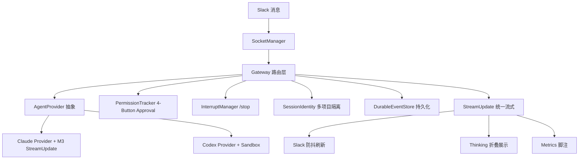

# ChorusGate 迭代四回顾 —— 项目级汇报

> **汇报日期**: 2026-06-21
> **汇报人**: 小马（评审/测试整合），结合小克（开发）、小扣（管理整合）
> **目标受众**: 管理层 / 项目老板
> **迭代分支**: `v4/unified-stream`
> **时间跨度**: 2026-06-17 ~ 2026-06-21

---

## 一、执行摘要（老板视角）

迭代四（v4）核心目标：**技术债务清零 + 补齐 v3 遗留的流式能力 + 建立 session worktree 隔离**。最终交付：

- **P0 技术债务 3 项全部清零**（#93 env var 顶层 const、#94 onSpawn、#95 find-up scope）
- **P1 测试基建 2 项全部完成**（#96 npm test 拆分、#97 MCP mock 降级）
- **P1 Codex CLI Provider Bug 修复 5 项全部回归通过**（#117~#121）
- **核心功能 3 项全部上线**：DurableEventStore（持久化）、StreamUpdate（Claude M3 token 级增量）、/stop 命令（进程终止）
- **Codex 沙箱模式落地**（以 `-s workspace-write` 替代不可行的 stdin 审批协议）

**未完成**：Session Worktree（#33）因复杂度延期至 v5；Codex 全链路双向审批因 CLI 不支持 `--ask-for-approval` 改为沙箱方案。

**一句话结论**：v4 在技术债务清零、测试基建、流式能力三个维度完成了关键跃迁，剩余 worktree 和完整审批链在 v5 继续。

---

## 二、关键数据一览

| 指标 | 数值 | 备注 |
|------|------|------|
| P0 技术债务清零 | **3/3** | #93 #94 #95 |
| P1 Bug 修复回归 | **5/5** | #117~#121，135->141 全绿 |
| P1 测试基建完成 | **2/2** | #96 拆分、#97 mock |
| 核心功能交付 | **3/3** | DurableEventStore、StreamUpdate、/stop |
| Codex 沙箱模式 | **已上线** | #84/#99 Spike + 实现 |
| 系统测试 ST | **141/141** | 88s 稳定，无 hang |
| TypeScript 检查 | **0 错误** | `npm run build` 全绿 |
| 新增 E2E 测试 | **5/5** | StreamUpdate 端到端，23.7s |
| 评审报告存档 | **3 份** | PR #1、#6、#84 |
| Session Worktree | **延期** | #33，v5 继续 |
| Codex 全链路审批 | **降级** | stdin 协议不可行，改沙箱 |

---

## 三、里程碑与进度

### 3.1 里程碑交付

| 里程碑 | 核心交付 | 状态 | 业务价值 |
|--------|---------|------|---------|
| **P0 技术债务清零** | #93 env var 惰性读取、#94 onSpawn 回调、#95 find-up 范围限制 | 3/3 | 配置安全、进程管理安全、跨项目 env 隔离 |
| **P1 测试基建** | npm test 拆分为 fast/integration，60s timeout，MCP mock 降级 | 完成 | 测试不再 hang，CI 可用 |
| **P1 Bug 修复** | #117~#121 Codex provider 5 项修复，回归全绿 | 5/5 | Windows 上 Codex 可用 |
| **DurableEventStore** | 持久化 event state + retry queue，140/140 测试通过 | PR #1 | 会话状态重启可恢复 |
| **StreamUpdate 统一流式** | Claude token 级增量（thinking/text/metrics）+ Codex 降级 | #85/#86 | 实时展示思考过程和进度 |
| **Slack /stop 命令** | `/cc_stop` 终止运行中 agent 进程，141/141 通过 | PR #6 | 终于可以中止死循环 |
| **Codex 沙箱模式** | `-s workspace-write` 替代 bypass，沙箱边界验证通过 | PR #84/#99 | Codex workspace 写入安全隔离 |
| **Session Worktree** | 多 session 并发隔离 | 延期 v5 | 多 session 并发安全 |
| **Codex 全链路审批** | stdin/stdout 双向审批协议 | 不可行 | 降级为沙箱模式 |

### 3.2 未完成 Issue

| Issue | 原因 | 计划 |
|-------|------|------|
| #33 Session Worktree | 复杂度超预期，v4 后期资源不足 | v5 第一项 |
| #84 Codex 全链路审批 | CLI 不支持 `--ask-for-approval`，stdin 协议不可行 | 降级为沙箱模式，已完成 |

---

## 四、架构演进

### 4.1 迭代前（v3 末）

```
用户 Slack 消息
    |
Gateway（无状态）
    |
Claude / Codex Provider（无进程管理回调）
    |
无增量展示 / 无进程终止 / 无持久化
```

### 4.2 迭代后（v4）



---

## 五、角色复盘

| 角色 | 主要职责 | 做得好的 | 下轮纪律 |
|------|---------|---------|---------|
| **小克（开发）** | P0 修复、Codex Bug 修复、DurableEventStore、StreamUpdate 实现 | 快速响应 P0；StreamUpdate 完整实现 token 级增量；沙箱方案务实 | env fix 必须改前改后双重验证；spawn/flag 修改必须真实验证；新增入口函数必须同步加 ST |
| **小马（评审/测试）** | ST 计划、代码评审、回归测试、E2E 测试 | 独立评审发现 P1（ESM require 混用）；工具链 resilient；SIT 交付规范落地 | E2E 测试文件必须随 PR 提交；评审发现必须同步建 GH issue；测试报告必须有可执行命令 + 实际输出 |
| **小扣（管理整合）** | 流程协调、技能 mirror、文档归档 | P2 技能自动 mirror 落地；Spike 评审推动方案务实（沙箱 vs 不可行审批） | 迭代回顾必须三方整合；延期项必须有明确 v5 承接计划 |

---

## 六、关键教训（Top 6）

| # | 教训 | 来源 | 已沉淀 |
|---|------|------|--------|
| 1 | **MSYS/Git-Bash PATH 在 Windows 上会报 `exit code 126` 并不代表文件不存在**，是路径解析问题，切换 `execute_code` Python subprocess 主路径绕过 | P0 修复期间 terminal 故障 | `chorusgate-st-windows` skill |
| 2 | **Codex CLI v0.139.0 不支持 `--ask-for-approval`**，设计文档假设必须实测验证，不可落地则及时降级 | #84 Spike | `chorusgate-st-windows` git-show fallback |
| 3 | **`require('node:fs')` 混用 CJS/ESM 是 ESM 项目 P1 级问题**，顶层 import 在模块加载时早于任何代码执行 | #124 (PR #1) | sprint-handoff skill |
| 4 | **Codex `--json` flag 位置必须在子命令之前**（`--json exec` 而非 `exec --json`），Windows shell 转义产生空 quote 对 | #117 #118 | 已修复，合入标准 |
| 5 | **E2E 测试必须用真实进程验证端到端链路**，组件级集成测试不能替代，mock 通过不等于真实路径正确 | StreamUpdate #85/#86 E2E 补充 | `sprint-handoff` SIT 规范 |
| 6 | **SIT 交付件必须有：方案策略 / 用例脚本 / 执行记录 / 测试报告 / 交付存档**，代码写完不算交付 | 迭代四 SIT 验收规范沉淀 | `sprint-handoff` 交付清单 |

---

## 七、迭代五（v5）预告

| 优先级 | Issue | 内容 |
|--------|-------|------|
| P0 | #33 | Session Worktree 隔离 |
| P1 | #84 | Codex 全链路审批（沙箱已就绪，探索 workspace-write 审批可能性） |
| P1 | StreamUpdate Slack E2E | Gateway placeholder 更新逻辑真实 Slack 验证 |
| P2 | #98 | 跨 runtime 技能自动 mirror |
| P2 | /retry, /model 命令 | Slack 命令扩展 |
| 中期 | #9 | 安装生命周期 + doctor 命令 |

---

*整理：小马 | 日期：2026-06-21*
*分支：v4/unified-stream*
